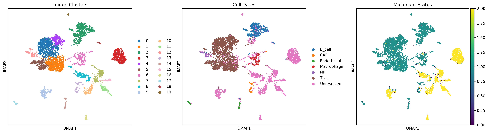
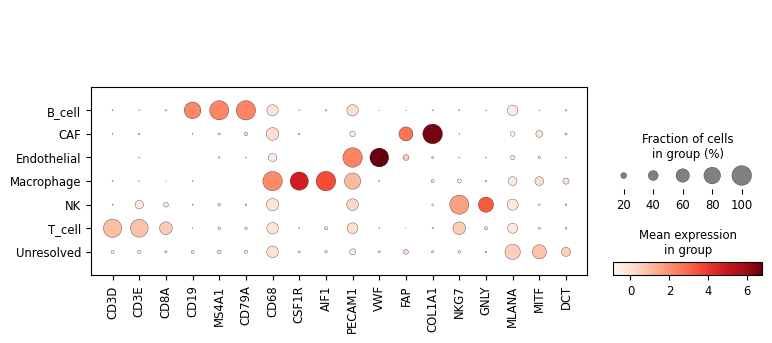
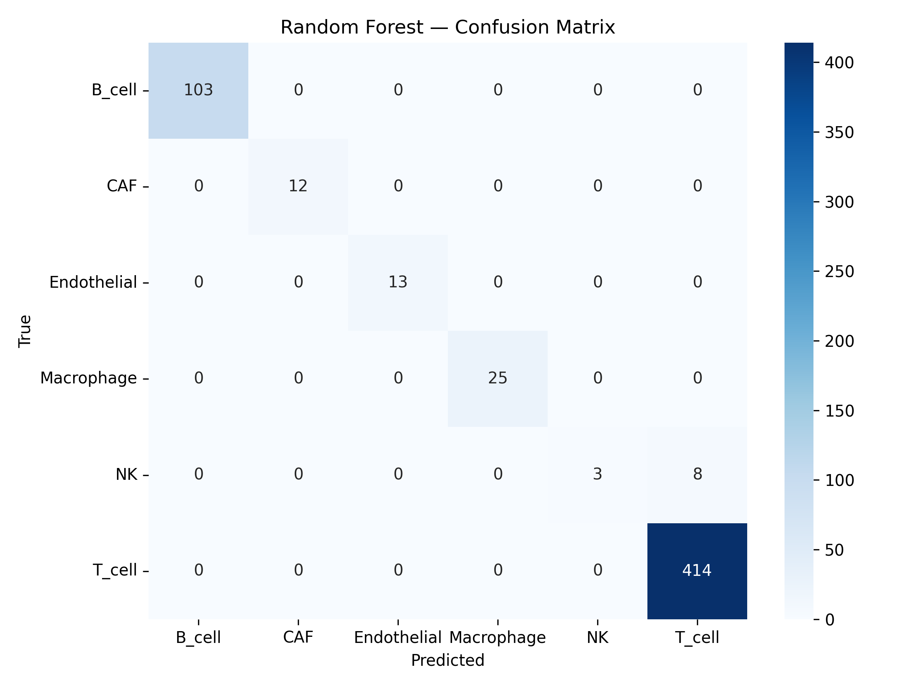
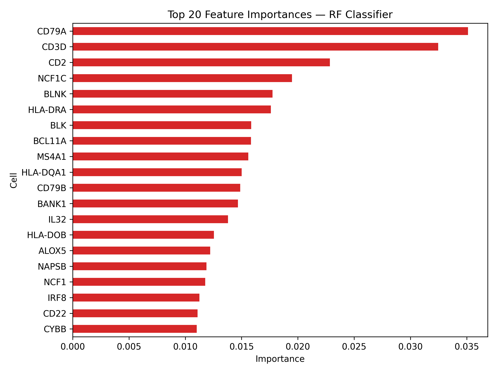

<<<<<<< HEAD
# scRNA-seq Cell Type Classification — Melanoma Tumor Microenvironment


---

## Overview

Single-cell RNA-seq analysis of **melanoma tumor microenvironment (TME)** using the public dataset **GSE72056**. The project covers full preprocessing, unsupervised clustering, cell-type annotation, and a **Random Forest classifier** trained to predict cell identity from transcriptomic features.

---

## Dataset

| Field | Details |
|---|---|
| **GEO Accession** | [GSE72056](https://www.ncbi.nlm.nih.gov/geo/query/acc.cgi?acc=GSE72056) |
| **Tissue** | Melanoma tumors (multiple patients) |
| **Organism** | *Homo sapiens* |
| **Cell types** | T cell, B cell, Macrophage, NK, CAF, Endothelial, Malignant |
| **Platform** | Smart-seq2 scRNA-seq |

---

## Analysis Pipeline

```
GEO Download → Raw count matrix
        │
        ▼
Metadata extraction (tumor_id, malignant status, cell_type)
        │
        ▼
AnnData construction + QC
  ├── Filter: min_genes=200, min_cells=3
  ├── Normalize (target_sum=1e4) + log1p
  └── Highly variable genes (n=2000)
        │
        ▼
Dimensionality Reduction
  ├── PCA (50 components)
  ├── KNN graph (n_neighbors=10, n_pcs=40)
  ├── UMAP
  └── Leiden clustering (resolution=0.5) → 20 clusters
        │
        ▼
Cell Type Annotation
  └── Marker gene dot plot (CD3D, CD68, MS4A1, VWF, FAP, NKG7, MLANA...)
        │
        ▼
ML Classification
  ├── Random Forest (100 trees, HVG features)
  ├── Train/test split (80/20, stratified)
  └── Evaluation: confusion matrix + feature importances
=======
# snRNA-seq Analysis of Parkinson's Disease — Human Midbrain


## Overview

End-to-end single-nucleus RNA sequencing (snRNA-seq) analysis pipeline for Parkinson's disease (PD) classification using post-mortem human midbrain tissue.  
Integrates unsupervised transcriptomic analysis with a supervised Random Forest machine learning classifier.

**Dataset:** GSE157783 — Human substantia nigra midbrain (NCBI GEO)  
**Scope:** 11 donors (5 PD, 6 Control), 39,606 nuclei after QC  
**Technology:** 10x Genomics Chromium snRNA-seq

---

## Clinical Question

> *Can single-nucleus transcriptomic profiles distinguish Parkinson's disease nuclei from healthy controls, and what genes drive this classification?*

---

## Pipeline Summary

```
GSE157783 (NCBI GEO)
      │
      ▼
Data Loading & AnnData Construction
  └── 41,434 raw nuclei → 39,606 after QC
      │
      ▼
Quality Control
  ├── Min genes/nucleus : 200
  ├── Max genes/nucleus : 6,000
  └── Min cells/gene    : 10
      │
      ▼
Normalization + HVG Selection
  └── 2,000 highly variable genes
      │
      ▼
PCA → Harmony Batch Correction
  └── 40 PCs, batch = donor (sample_id)
      │
      ▼
Leiden Clustering (resolution 0.5)
  └── 21 transcriptionally distinct clusters
      │
      ▼
UMAP Visualization
  ├── Cell clusters (21 Leiden)
  └── PD vs Control overlay
      │
      ▼
Cell Type Annotation
  └── 12 major brain cell populations
      │
      ▼
Dopaminergic Neuron Analysis
  └── 47 DaN nuclei (0.119%) — consistent with PD neurodegeneration
      │
      ▼
Random Forest Classifier (5-fold CV)
  └── Mean AUC = 0.898 ± 0.005
>>>>>>> 12998a76caa180278d3c668331085b6f54591213
```

---

<<<<<<< HEAD
## Key Results

### Clustering
- **20 Leiden clusters** resolved from ~4,600 cells
- Clear separation of immune, stromal, and malignant populations on UMAP

### Random Forest Classifier

| Cell Type | Performance |
|---|---|
| B_cell | 103/103 correct |
| T_cell | 414/414 correct |
| Macrophage | 25/25 correct |
| Endothelial | 13/13 correct |
| CAF | 12/12 correct |
| NK | 3/11 correct (confused with T_cell) |

> **Overall accuracy: ~97%** — NK cells are the only challenge due to transcriptomic similarity with T cells (shared cytotoxic gene program).

### Top Predictive Features (RF)
`CD79A` · `CD3D` · `CD2` · `NCF1C` · `BLNK` · `HLA-DRA` · `MS4A1` · `BLK`

> Biologically coherent — B cell markers (CD79A, BLNK, MS4A1) and T cell markers (CD3D, CD2) dominate feature importance rankings.

---

## Visualizations

### UMAP — Clusters · Cell Types · Malignant Status


### Marker Gene Dot Plot


### RF Confusion Matrix


### Top 20 Feature Importances

=======
## Key Findings

| Metric | Value |
|--------|-------|
| Nuclei after QC | 39,606 |
| Leiden clusters | 21 |
| Cell types identified | 12 |
| Dopaminergic neurons found | 47 (0.119%) |
| Random Forest AUC | **0.898 ± 0.005** |
| Control accuracy | 3993 / 4000 correct |
| PD accuracy | 3650 / 4000 correct |

### Cell Type Composition

| Cell Type | Nuclei | % |
|-----------|--------|---|
| Oligodendrocytes | 21,192 | 53.5 |
| Astrocytes | 4,687 | 11.8 |
| Microglia | 3,899 | 9.8 |
| OPCs | 2,751 | 6.9 |
| Excitatory Neurons | 2,062 | 5.2 |
| Endothelial Cells | 1,723 | 4.3 |
| Pericytes | 1,228 | 3.1 |
| Inhibitory Neurons | 922 | 2.3 |
| Ependymal Cells | 531 | 1.3 |
| GABA Neurons | 444 | 1.1 |
| CADPS2+ Neurons | 120 | 0.3 |
| **Dopaminergic Neurons** | **47** | **0.12** |

---

## Figures

| Figure | Description |
|--------|-------------|
| `results/figures/qc_violin.png` | QC metrics — gene counts and total counts before filtering |
| `results/figures/umap_clusters.png` | UMAP — 21 Leiden clusters coloured by cluster ID |
| `results/figures/umap_pd_vs_control.png` | UMAP — PD vs Control nuclei overlay |
| `results/figures/dan_proportion_boxplot.png` | Boxplot — dopaminergic neuron proportion per donor |
| `results/figures/roc_curve.png` | ROC curve — Random Forest 5-fold CV (AUC = 0.898) |
| `results/figures/feature_importance.png` | Top 20 genes by Random Forest feature importance |
| `results/figures/confusion_matrix.png` | Confusion matrix — PD vs Control final classifier |

---

## Tools & Versions

| Tool | Version | Purpose |
|------|---------|---------|
| scanpy | 1.10.x | Core snRNA-seq analysis framework |
| anndata | 0.10.x | Annotated data matrix format |
| harmonypy | 0.0.9 | Multi-donor batch correction |
| scikit-learn | 1.4.x | Random Forest classifier and evaluation |
| leidenalg | 0.10.x | Leiden clustering algorithm |
| pandas | 2.x | Data manipulation |
| numpy | 1.26.x | Numerical computation |
| scipy | 1.12.x | Sparse matrix handling |
| matplotlib | 3.8.x | Figure generation |
| seaborn | 0.13.x | Statistical visualisation |
| python-igraph | 0.11.x | Graph construction for clustering |
| Python | 3.11 | Core environment |
>>>>>>> 12998a76caa180278d3c668331085b6f54591213

---

## Repository Structure

```
<<<<<<< HEAD
ml-pathogenicity-classifier/
├── analysis/
│   ├── scrna_seq_melanoma.py     # Main pipeline (Colab)
│   └── adsf.py                   # scVelo pseudotime (malignant subset)
├── results/
│   ├── GSE72056_RF_model.pkl     # Trained RF model
│   └── figures/
│       ├── GSE72056_UMAP.png
│       ├── dotplot__GSE72056_markers.png
│       ├── GSE72056_RF_confusion.png
│       └── GSE72056_RF_features.png
└── README.md
=======
snrna-pd-analysis/
├── README.md                          # This file
├── environment.yml                    # Conda environment
├── .gitignore                         # Excludes large data files
│
├── data/
│   └── download_gse157783.sh          # Download script for GSE157783
│
├── workflow/
│   └── miniproject_snrna_pd.py        # Full pipeline script (Colab-ready)
│
├── results/
│   ├── qc/
│   │   └── qc_summary.md              # QC filtering statistics
│   └── figures/
│       ├── qc_violin.png
│       ├── umap_clusters.png
│       ├── umap_pd_vs_control.png
│       ├── dan_proportion_boxplot.png
│       ├── roc_curve.png
│       ├── feature_importance.png
│       └── confusion_matrix.png
│
├── notebooks/
│   └── README.md                      # Colab notebook instructions
│
└── report/
    └── clinical_interpretation.md     # Project report summary
>>>>>>> 12998a76caa180278d3c668331085b6f54591213
```

---

## How to Reproduce

<<<<<<< HEAD
### Requirements

```bash
pip install scanpy leidenalg igraph scikit-learn seaborn anndata scvelo
```

### Run

```python
# Option 1: Google Colab (recommended)
# Open analysis/scrna_seq_melanoma.py in Colab — data auto-downloads from GEO

# Option 2: Local
python analysis/scrna_seq_melanoma.py
```

### Load saved model

```python
import pickle
with open("results/GSE72056_RF_model.pkl", "rb") as f:
    rf = pickle.load(f)
# rf.predict(X_new)
=======
### Option A — Google Colab (recommended)

1. Open `workflow/miniproject_snrna_pd.py` in Google Colab
2. Download GSE157783 files from NCBI GEO (see `data/download_gse157783.sh`)
3. Run all cells in order
4. Runtime: ~45–60 minutes on Colab free tier

### Option B — Local

```bash
git clone https://github.com/YOUR_USERNAME/snrna-pd-analysis
cd snrna-pd-analysis

conda env create -f environment.yml
conda activate snrna-pd

bash data/download_gse157783.sh
python workflow/miniproject_snrna_pd.py
>>>>>>> 12998a76caa180278d3c668331085b6f54591213
```

---

<<<<<<< HEAD
## Tools & Packages

| Tool | Purpose |
|---|---|
| Scanpy | QC, normalization, PCA, UMAP, Leiden clustering |
| AnnData | Single-cell data structure |
| scikit-learn | Random Forest classifier |
| scVelo | RNA velocity + pseudotime (malignant subset) |
| seaborn / matplotlib | Visualization |

---

## Author

**Ganapathirajan P**
MSc Bioinformatics & Data Science — Sathyabama Institute of Science and Technology

[](https://www.linkedin.com/in/grp1)
[](https://github.com/Ganapathirajan)

---

## License

MIT License — see [LICENSE](LICENSE)
=======
## Data Sources

| Resource | URL |
|----------|-----|
| GSE157783 dataset | https://www.ncbi.nlm.nih.gov/geo/query/acc.cgi?acc=GSE157783 |
| Original paper (Kamath et al. 2022) | https://doi.org/10.1038/s41593-022-01061-1 |
| Scanpy documentation | https://scanpy.readthedocs.io |
| Harmony paper | https://doi.org/10.1038/s41592-019-0619-0 |

---

## Limitations & Notes

- Dataset restricted to **substantia nigra / midbrain region** only
- Parental genotypes are from **post-mortem tissue** — donor-specific batch effects corrected via Harmony
- Gene identifiers remain as **Ensembl IDs** — direct mapping to gene symbols (SNCA, LRRK2) was limited by dataset format
- Dopaminergic neuron count (47 nuclei) is extremely low — statistics should be interpreted cautiously
- This is a **training/portfolio project** — not validated for clinical use

---

## Skills Demonstrated

- snRNA-seq preprocessing and quality control (Scanpy)
- Multi-donor batch correction (Harmony)
- Dimensionality reduction: PCA + UMAP
- Graph-based clustering: Leiden algorithm
- Cell type annotation using marker genes
- Supervised ML classification (Random Forest, 5-fold CV)
- ROC-AUC evaluation and feature importance analysis
- Reproducible cloud-based bioinformatics (Google Colab)

---

*Dataset: GSE157783, publicly available via NCBI GEO. Not for clinical use.*
>>>>>>> 12998a76caa180278d3c668331085b6f54591213
